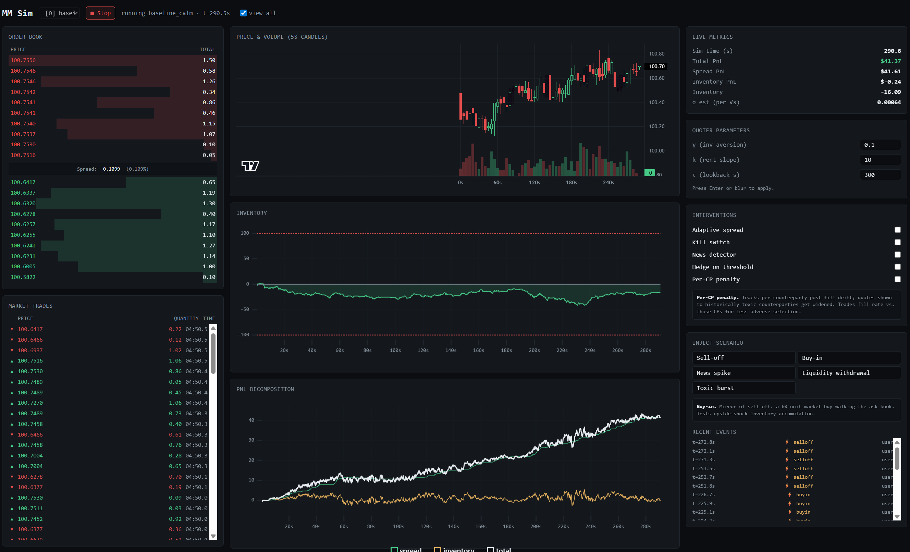

# Market-Maker Simulator & Parameter Lab

A discrete-time **Avellaneda–Stoikov** market-making simulator with a stress-scenario
library, toggleable risk interventions, and a real-time UI for poking the quoter
mid-flight. The headline deliverable is the **Findings Document**
([findings.md](docs/findings.md) · [PDF](docs/findings.pdf));
everything else exists to make those findings reproducible and inspectable.



> **Read the findings:** [findings.md](docs/findings.md) · [findings.pdf](docs/findings.pdf) · [math appendix](docs/math_appendix.md)

## Live UI at a glance

The screenshot above is the running app at `http://localhost:5173/` against
`baseline_calm`. Three columns:

- **Left** — L2 order book ladder (bids/asks with depth bars, centered spread
  row) and a market-trades tape (▲ buy aggressor, ▼ sell aggressor, time
  in MM:SS.ms of sim time).
- **Center** — Price & 5-second OHLC volume candles
  (TradingView lightweight-charts), inventory area, and PnL decomposition
  lines (uPlot canvas). The `view all` toggle in the
  header keeps up to 60 minutes of history instead of the default 6.
- **Right** — live numeric metrics, the three quoter knobs
  (γ, k, τ — Hit 'enter' or tab/click out to apply), the five interventions
  (adaptive spread, kill switch, news detector, hedge-on-threshold,
  per-CP penalty — hover for an inline description), the scenario
  injector (sell-off, buy-in, news spike, liquidity withdrawal, toxic
  burst), and the unified events log (⚡ scenarios, 🛡 intervention
  firings).

## What's in here

- **`backend/mm_sim/`** — the simulation engine: market processes (GBM,
  OU, jump-diffusion), L2 order book, noise + informed traders, the AS
  quoter (infinite-horizon variant), five toggleable interventions,
  online metrics, and parquet results writer.
- **`backend/runner/`** — headless CLI that consumes
  `backend/experiments.yaml` and runs experiments in series or with
  multiprocessing.
- **`backend/server/`** — FastAPI + WebSocket server for the live UI.
- **`frontend/`** — Vite + React + TypeScript single-page app. Canvas
  charts (lightweight-charts + uPlot), zustand stores split between
  control state (1 Hz) and chart state (10 Hz throttled), and a stable
  WS pump that reconnects automatically.
- **`notebooks/`** — Python analysis scripts (one per finding) that
  read parquet results and emit every chart referenced in the findings
  document.
- **`docs/`** — [`findings.md`](docs/findings.md) (the analytical write-up),
  [`math_appendix.md`](docs/math_appendix.md), and `figures/`
  (PNGs produced by the notebooks).
- **`scripts/`** — one-line build steps:
  `run_all_experiments.sh`, `render_all_figures.sh`, `build_findings_pdf.sh`.

## Run it from scratch

```bash
# 1. install
uv sync --extra dev --extra notebooks
pnpm --dir frontend install

# 2. run the experiments (~5hr single-thread; ~1hr with WORKERS=8)
WORKERS=8 bash scripts/run_all_experiments.sh

# 3. render every figure in the findings doc
bash scripts/render_all_figures.sh

# 4. build the findings PDF (requires pandoc + xelatex)
bash scripts/build_findings_pdf.sh
```

## Run a single experiment

```bash
uv run python -m runner.cli list                              # show all experiments
uv run python -m runner.cli run "f1_gamma_sweep_low_vol"      # one
uv run python -m runner.cli run "f1_*" --workers 4            # all of finding 1
uv run python -m runner.cli run "baseline_calm" --dry-run     # show the resolved configs without running
```

## Run the live UI

Two terminals:

```bash
# backend
uv run uvicorn server.app:app --reload --app-dir backend

# frontend
pnpm --dir frontend dev
```

Then open <http://localhost:5173>. Pick an experiment from the dropdown,
press **Start**, and:

- **retune** γ / k / τ (Enter or blur to commit — you'll see ✓ applied at t=…s),
- **toggle interventions** (the inline info panel below the checkboxes
  describes each one — adaptive spread, kill switch, news detector,
  hedge on threshold, per-CP penalty),
- **inject a scenario** (sell-off, buy-in, news spike, liquidity
  withdrawal, toxic burst — descriptions show on hover) and watch
  it land in the events log alongside any intervention firings it
  triggers.

## Run tests

```bash
uv run pytest
```

## What's modelled vs what isn't

This is a **teaching/demonstration tool**, not a production system. See
[`docs/findings.md`](docs/findings.md) §9 for the explicit list of what's
deliberately out of scope (latency modelling, real fee schedules,
multi-venue, real microstructure, ML, real exchange connectivity).

## License

MIT.
