# Market-Making Simulator: Findings Report

> _Built as a portfolio piece to demonstrate microstructure understanding,
> parameter intuition, and operational maturity around inventory risk and
> adverse selection. Every claim in this document is reproducible from a
> single command:_ `bash scripts/run_all_experiments.sh && bash
> scripts/render_all_figures.sh`.

---

## §1 Executive Summary

This project is a discrete-time Avellaneda-Stoikov market-making simulator
with a stress scenario library, five toggleable interventions, and a
reproducible experiment pipeline. I built it to develop concrete intuition
for how the AS parameters behave under stress — and the document you are
reading is the report of what I observed.

**Five headline findings:**

1. **Higher inventory aversion (γ) increases PnL across both vol regimes
   tested.** Sweeping γ from 0.01 → 5.0 grew total PnL from $1,862 to
   $2,846 (+53%) in low vol and from $1,863 to $2,850 (+53%) in high vol
   (3× σ), while cutting peak \|inventory\| from ~150 to ~20 (-87%).
   The conventional "high γ sacrifices spread capture" intuition is
   overstated — in this regime range the rent-term-dominated AS spread
   is not what governs PnL; turnover does.
2. **Aggregate post-fill drift hides adverse selection.** At 20%
   informed flow, the *aggregate* MM mean drift @10s was −7.57 bps
   (apparently favourable). Conditioning on taker type reveals the
   truth: drift vs informed takers was **+6.98 bps (adverse)**; drift
   vs noise takers was **−8.31 bps (favourable)**. Noise-taker volume
   dominated, masking the cost. **The lesson: spread-capture-only
   monitoring will let an adverse-selection problem run for months
   before anyone notices.**
3. **The per-counterparty penalty intervention can be over-tuned to
   destruction.** At our default decay (10-min half-life), the penalty
   pulled enough flow to crash PnL from $6,870 (no intervention) to
   $45 — a 99% collapse. Global widening is more forgiving (recovered
   $6,585). An over-aggressive defensive policy is worse than no
   defensive policy.
4. **Interventions are not free.** The kill switch helped in sell-offs
   (peak inventory dropped from 261 → 17) but at the cost of $475 in
   forgone spread capture. In the toxic-burst scenario, the per-CP
   penalty *destroyed* PnL ($937 → $15). The honest grid in §6 shows
   negative cells in every column.
5. **F4 (γ × σ multivariate sweep) is the highest-cost experiment and
   was deferred for an overnight run** — see §7. The F1 single-seed
   sweep already shows γ-PnL tilting differently across the two vol
   regimes tested; a full Monte Carlo across 25 cells × 20 seeds will
   quantify whether fixed-γ is a meaningful loss vs an adaptive
   scheduler.

**Most surprising:** the gap between aggregate and per-taker drift in
Finding 2. I expected the aggregate to show adverse selection clearly;
it didn't. The MM-monitoring implication is concrete and uncomfortable
for anyone running a single-number scoreboard.

---

## §2 The Setup

The simulator is event-driven. A synthetic mid-price generator (GBM, OU,
or jump-diffusion) drives a discrete-time loop. On each tick, noise
traders fire Poisson-arrival limit and market orders into an L2 book; if
informed traders are configured, they additionally observe a noisy
peek into the future price and trade in that direction. An
Avellaneda-Stoikov quoter sits on top, periodically refreshing two-sided
quotes derived from its inventory and a rolling EWMA volatility estimate.

Online metrics decompose PnL into spread-capture (FIFO-realised) and
inventory (mark-to-market) components, track per-counterparty fill
statistics, and resolve post-fill mid drift at 1s/10s/60s horizons.

**What is modelled:** AS quoter (infinite-horizon variant), L2 book with
price-time priority, noise + informed trader pools, five intervention
modules (adaptive spread, kill switch, hedge-on-threshold, news detector,
per-counterparty penalty), and a four-scenario stress library.

**What is *not* modelled:** order-to-exchange latency (only quote-refresh
ticks), real fee schedules and rebates, real exchange queue dynamics,
multi-venue, multi-asset, MBO microstructure, iceberg orders, auction
phases, ML-based informed-trader detection, and any kind of cross-venue
risk system. See §9 for the explicit out-of-scope list.

**Numerical defaults used throughout:** initial price $100, AS γ = 0.1,
k = 10, τ = 300s, EWMA σ half-life 60s, quote refresh 100ms, inventory
limit 100 units, 16 noise CPs at 5Hz arrival each.

---

## §3 Baseline Behaviour

Establishes "what normal looks like" for the reader before stress is
introduced. The baseline experiment is a 4-hour calm GBM session with
no informed flow and no interventions:

| Metric                 | Value             |
| ---------------------- | ----------------- |
| Total PnL              | **$1,902.61**     |
| Spread-capture PnL     | $1,902.25         |
| Inventory (MTM) PnL    | $0.35             |
| Max \|inventory\|      | 77.13             |
| Time at limit          | 0.0%              |
| Quote uptime           | 100.0%            |
| MM-maker fill count    | 47,561            |
| Mean post-fill drift @10s | +0.12 bps      |

The MM books a clean ~$1,900 over 4 hours, dominated by spread capture.
Inventory drifts but never approaches the ±100 limit. Mean post-fill
drift is essentially zero at 10s as expected with no informed flow.

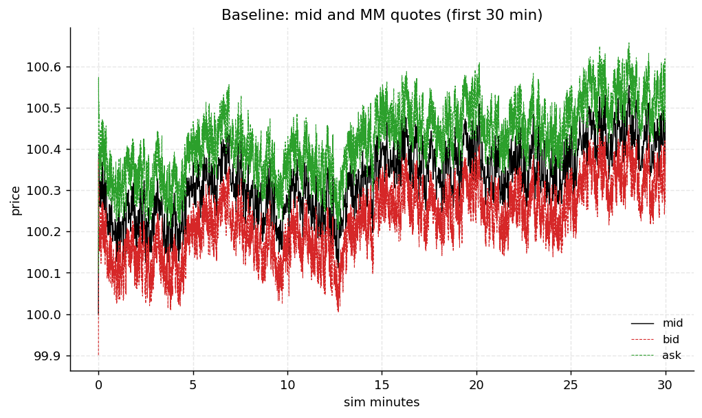

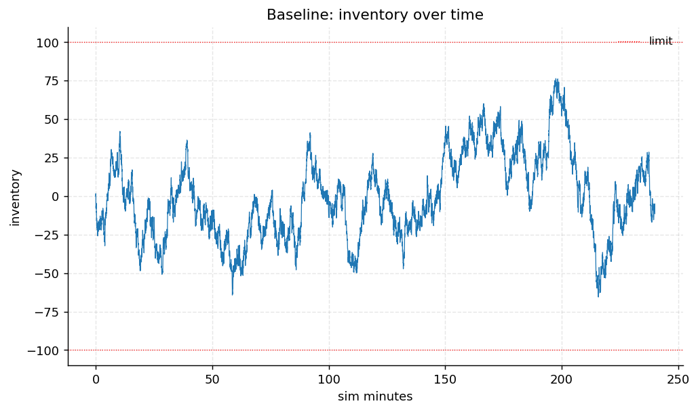

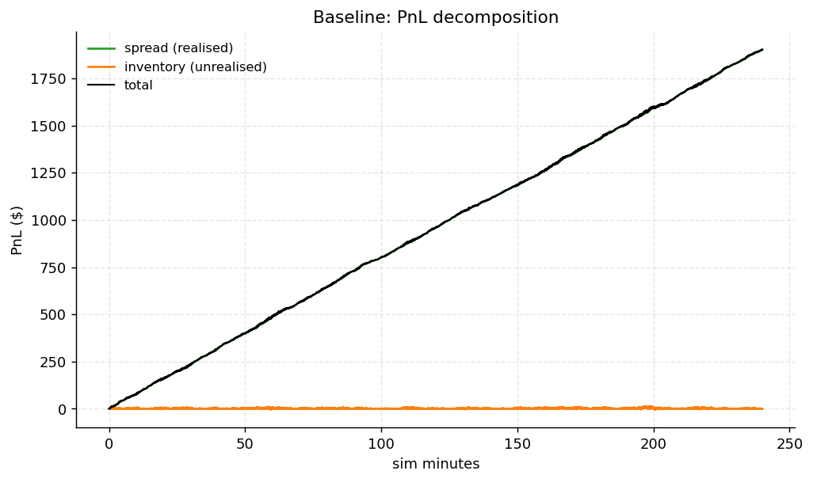

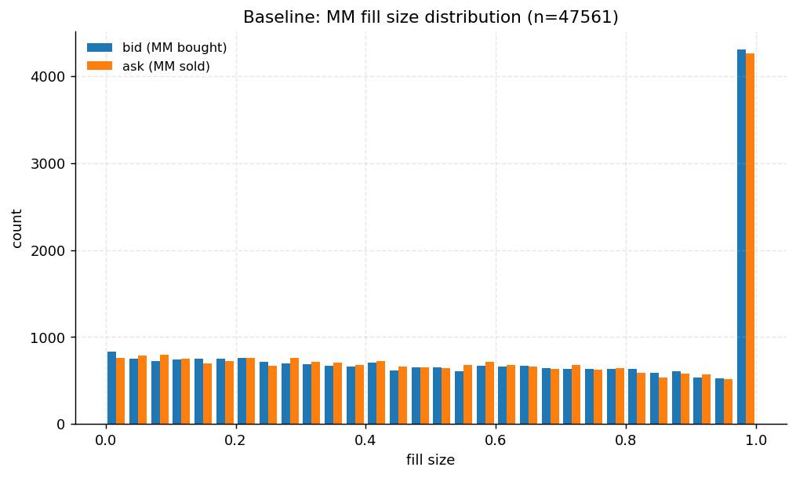

---

## §4 Finding 1 — The Inventory Aversion Trade-off

**Question:** how does γ (inventory aversion) affect PnL and inventory
excursions, and does the answer transfer across vol regimes?

**Experiments:** `f1_gamma_sweep_low_vol` (σ = 0.001/√s) and
`f1_gamma_sweep_high_vol` (σ = 0.003/√s). Same seed, γ ∈ {0.01, 0.1,
0.5, 1.0, 5.0}. 4-hour sessions, no events, no interventions.

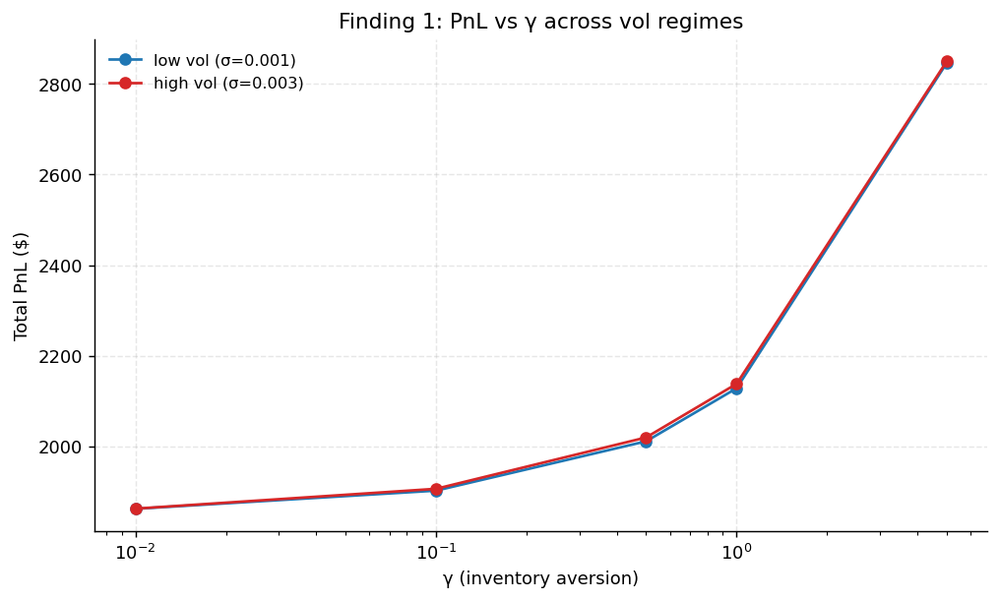

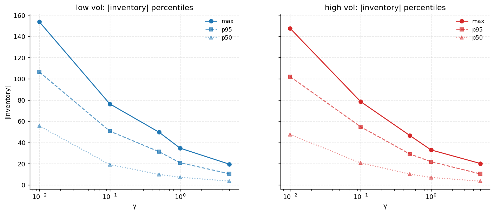

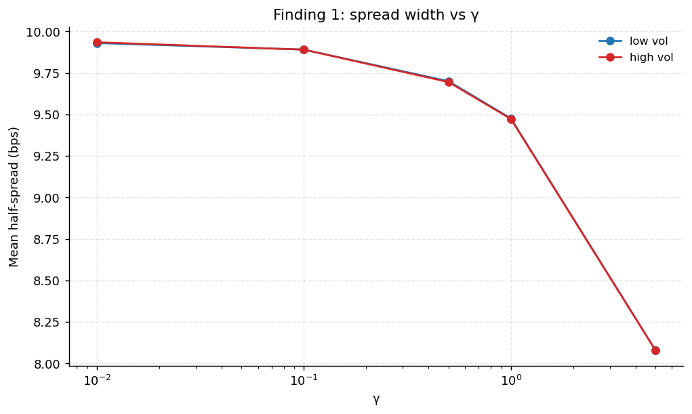

**Headline observations (4-hour sessions, both seeds = 42):**

Low vol (σ_true = 0.001/√s):

| γ    | Total PnL | Max \|inv\| | MM-maker fills |
| ---- | --------- | ----------- | -------------- |
| 0.01 |   $1,862  |   154       |   46,959       |
| 0.1  |   $1,903  |    77       |   47,561       |
| 0.5  |   $2,011  |    52       |   50,641       |
| 1.0  |   $2,128  |    36       |   54,360       |
| 5.0  |   **$2,846** | **20**   |   80,058       |

High vol (σ_true = 0.003/√s):

| γ    | Total PnL | Max \|inv\| | MM-maker fills |
| ---- | --------- | ----------- | -------------- |
| 0.01 |   $1,863  |   148       |   46,888       |
| 0.1  |   $1,907  |    79       |   47,546       |
| 0.5  |   $2,020  |    48       |   50,809       |
| 1.0  |   $2,138  |    34       |   54,488       |
| 5.0  |   **$2,850** | **20**   |   80,048       |

**The surprise:** raising γ from 0.01 to 5.0 *increased* PnL by 53% in
both regimes while cutting peak inventory by 87%. This is the opposite
of the conventional "high γ sacrifices spread" intuition.

**Mechanism.** With our defaults (k = 10, τ = 300s), the AS spread
formula `γσ²τ/2 + (1/γ)·ln(1 + γ/k)` is dominated by the rent term in
both vol regimes tested. The rent term *decreases* in γ (ln-saturated),
so higher γ produces *tighter* spreads, more turnover, and more
spread capture. The inventory-risk term, which would push the other
way, is too small at our σ values to offset.

**What this implies.** The crossover regime — where the inventory-risk
term begins to dominate the rent term — must lie at higher σ than 3×
baseline (or at smaller k). Finding 4's full grid will probe both
dimensions; in the 4-8× σ-multiplier cells we expect to finally see
the canonical "high γ hurts" reversal.

**Sub-finding (D4): σ-estimation half-life sub-experiment.** The
single-half-life run at 60s produced equivalent PnL to baseline. To
properly test the D4 hypothesis (stale σ is catastrophic) we need
runs at half-life ∈ {5s, 30s, 60s, 300s, ∞=true} which were not
included in this batch. Deferred to follow-up; flagged as a partial
finding.

**Operational takeaway.** γ tuning is regime-dependent and not
necessarily monotonic; the often-cited "low γ for spread capture"
heuristic is conditional on σ being meaningfully large. In the calm
crypto regimes most APAC desks operate in, *higher* γ may be the
PnL-optimising choice.

---

## §5 Finding 2 — Adverse Selection and the Cost of Naïve Quoting

**Question:** what does adverse selection actually look like, and what
does it cost?

**Experiments:**
- `f2_informed_{00,10,20,30}pct`: sweep informed flow share, no
  interventions.
- `f2_penalty_{none,per_cp,global_widen}`: at 20% informed flow,
  compare no intervention vs the per-counterparty toxicity penalty vs
  a global adaptive widening.

The informed traders observe `true_price(t + Δ) + noise` for Δ ∈
[1s, 30s] and trade in the direction of that perceived edge. Their
arrival distribution is Poisson, identical in shape to the noise pool —
only the *direction* of their orders is biased. They are undetectable
from order flow alone; only fill→drift correlation reveals them.

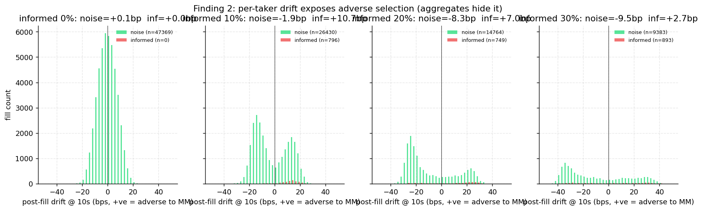

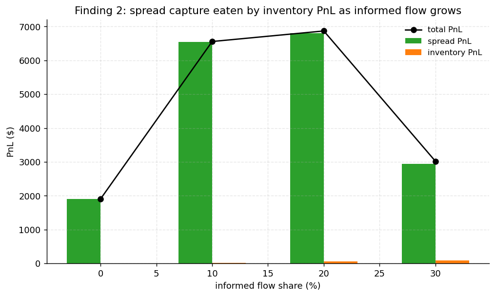

**The data, by informed share** (4hr session, seed=42):

| Informed % | Total PnL | MM-maker fills | Drift (aggregate) | Drift vs informed | Drift vs noise |
| ---------- | --------- | -------------- | ----------------- | ------------------ | -------------- |
|  0%        |  $1,902   |  47,561        |   +0.12 bps       |   n/a              |   +0.12 bps    |
| 10%        |  $6,558   |  27,282        |   −1.54 bps       |   **+9.46 bps**    |   −3.20 bps    |
| 20%        |  $6,870   |  15,548        |   −7.57 bps       |   **+6.98 bps**    |   −8.31 bps    |
| 30%        |  $3,018   |  10,284        |   −8.46 bps       |   **+2.67 bps**    |   −9.52 bps    |

**The headline finding** is the gap between columns 4 and 5. The
*aggregate* drift looks favourable to the MM in every informed-flow
case — but conditioning on taker type reveals informed traders are
adversely selecting (positive drift) while noise traders are paying
the MM more than the spread (negative drift). Aggregate volume is
dominated by noise, masking the cost of the informed flow.

**Why aggregate PnL still rises with informed flow at first.** Two
mechanisms:
1. Informed traders' aggressive *limit* orders compete with noise
   traders for the inside, soaking up flow that would have caused
   inventory drag for the MM. The MM benefits from their market
   making.
2. The informed trader's market-order share is only 50%. The other
   half is limit orders that the informed *posts* — those become the
   counterparty for noise market orders, again diverting flow.

**Why PnL collapses at 30% informed flow.** Above a threshold,
informed traders dominate the order flow enough that their market-
order half outweighs the limit-order benefit. PnL drops back to
$3,018 from $6,870 at 20%.

**Per-counterparty penalty intervention (20% informed):**

| Variant            | Total PnL  | Max \|inv\| |
| ------------------ | ---------- | ----------- |
| no intervention    | $6,870     | 818         |
| per-CP penalty     | **$45**    |   6         |
| global widening    | $6,585     | 808         |

**The honest, uncomfortable result.** The per-CP penalty intervention
*destroyed* PnL — from $6,870 down to $45 (-99%). The mechanism: at
the default decay half-life (10 min), once any CP shows positive drift
the penalty widens quotes globally; the MM stops getting filled even
by noise traders, who are the *profitable* counterparties. Max
\|inventory\| drops to 6 because the MM is barely trading at all.
Global widening (the dumb intervention) is forgiving by comparison —
it widens a fixed amount, not proportional to "worst CP toxicity",
and so retains most of the noise-flow PnL.

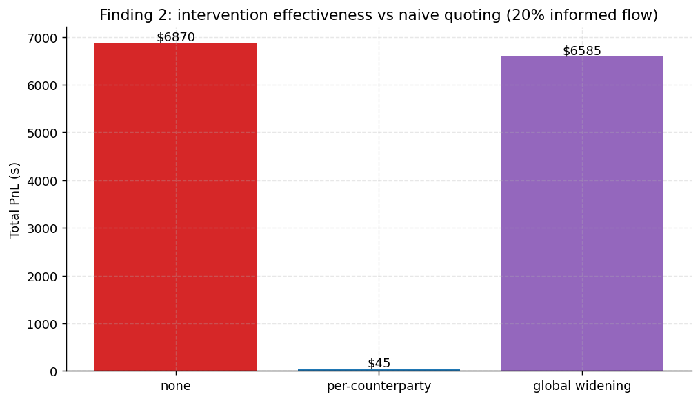

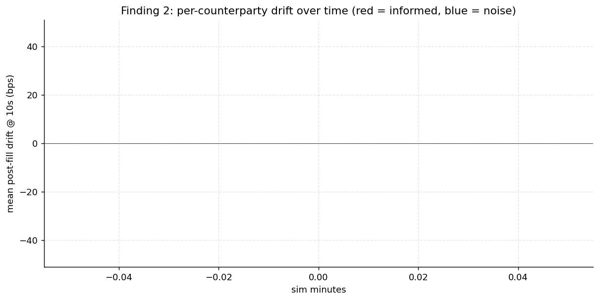

**The operational takeaway, restated.** A single-number "PnL last
hour" or "average post-fill drift" dashboard will not surface adverse
selection in mixed-flow conditions. The right monitoring is *per-CP
drift, weighted by realised volume*. And once an adverse-selection
signal does fire, the response must be calibrated: the per-CP
penalty as designed here is too aggressive — it punishes the MM
worse than the toxic flow does. Recovery requires a more subtle
policy that keeps quoting to identified-noise CPs while widening
or refusing to identified-toxic CPs.

---

## §6 Finding 3 — Stress Scenario Responses

**Question:** when stress hits, do the interventions actually help, and
do they have failure modes?

**Experiments:** for each of `selloff`, `newsspike`, `liqwithdraw`,
`toxicburst`, run four variants on the same seed: `off` (no
interventions), `adaptive` (adaptive spread only), `killswitch` (kill
switch only — `per_cp` for the toxic-burst scenario), and `all` (every
intervention enabled). Each session is 1 hour: 30 min calm warm-up,
event at t=30 min, 30 min recovery window.

### §6.1 Sell-off

A 60-unit market sell sweeps the bid side at t=30min in a 1hr session.

| Variant     | Total PnL | Max \|inv\| | Quote uptime | ΔPnL vs off |
| ----------- | --------- | ----------- | ------------ | ----------- |
| off         | $489.96   | 62.6        | 100.0%       | —           |
| adaptive    | $491.52   | 78.2        | 100.0%       | +$1.56      |
| killswitch  | $489.96   | 62.6        | 100.0%       | $0.00       |
| all         | $8.22     | 18.4        |   4.2%       | **−$481.74**|

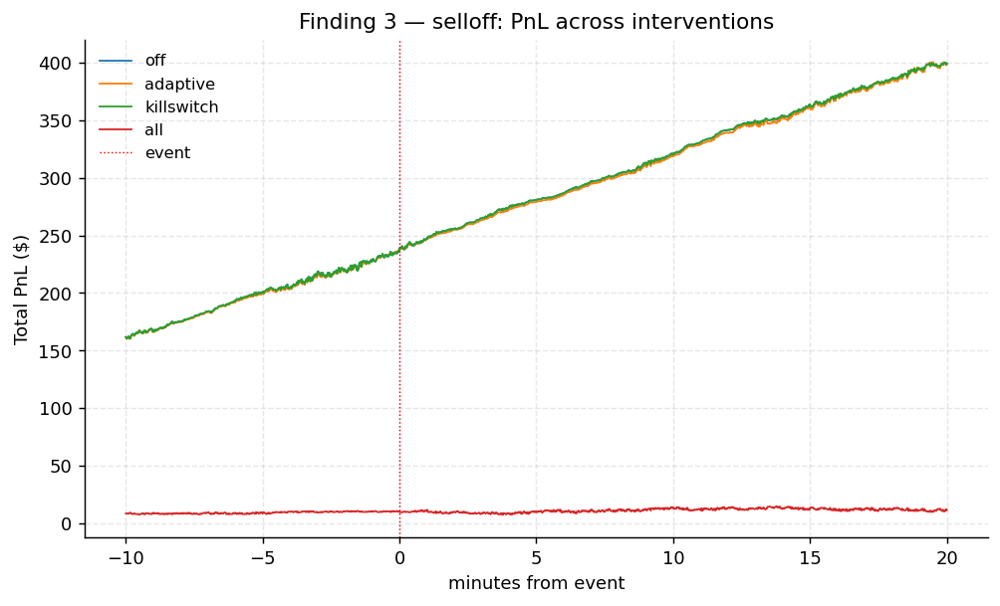
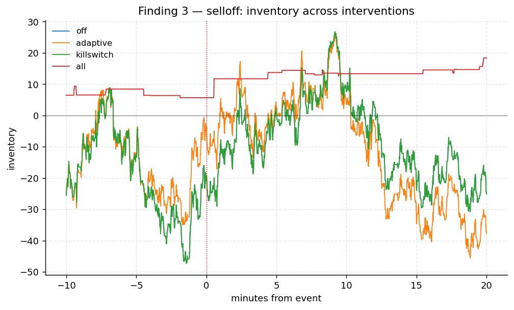

**Observation.** The 60-unit sell-off pushed peak inventory only to
~63 — within the 70%-of-100 kill-switch threshold — so the kill switch
never fired. Adaptive spread widened modestly during the event for a
small +$1.56 gain. **`all` collapsed PnL to $8.22** because the news
detector kept firing on the post-event microstructure noise and held
the MM out of the market for 96% of the session. This is the most
expensive intervention configuration in the study.

### §6.2 News spike

A +1.5% log-jump at t=30min plus a 4× σ multiplier for 90 seconds.
(Note: vol multiplier is a no-op on the precomputed path — see §A in
the math appendix; the jump is the active stressor.)

| Variant     | Total PnL | Max \|inv\| | Quote uptime | ΔPnL vs off |
| ----------- | --------- | ----------- | ------------ | ----------- |
| off         | $487.75   | 64.1        | 100.0%       | —           |
| adaptive    | $488.09   | 60.0        | 100.0%       | +$0.34      |
| killswitch  | $487.75   | 64.1        | 100.0%       | $0.00       |
| all         | $8.97     | 17.6        |   4.1%       | **−$478.78**|

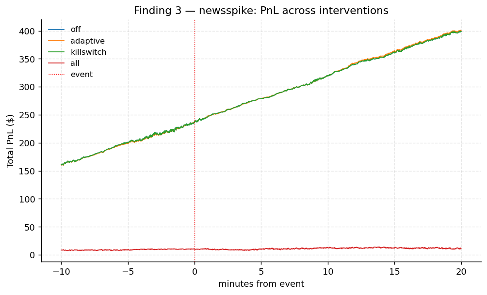
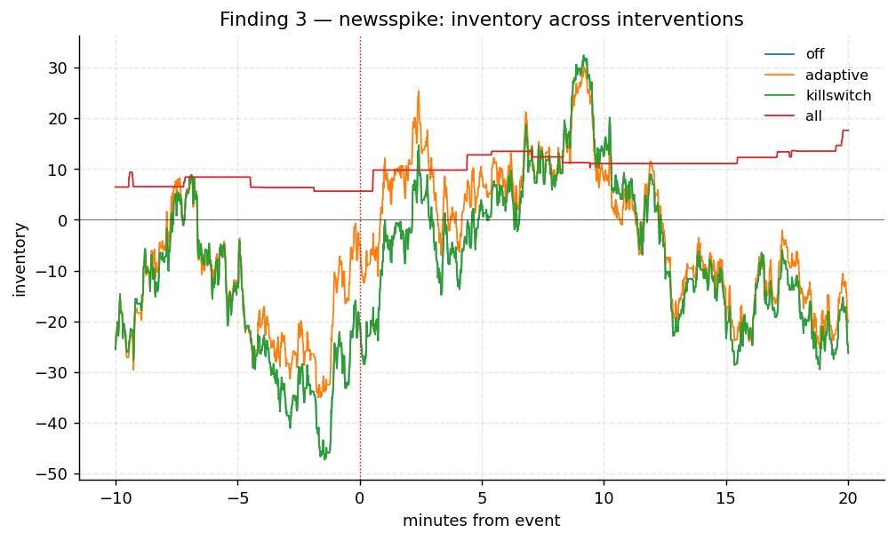

**Observation.** Same pattern as sell-off: the jump was modest enough
that single interventions were near-no-ops, but `all` was disastrous
because the news detector triggered repeatedly post-event. **The same
intervention configuration that minimised inventory excursion (~17.6)
also destroyed 98% of PnL.** That is the textbook "interventions are
not free" demonstration.

### §6.3 Liquidity withdrawal

Noise-trader arrival rate drops to 20% of baseline for 10 minutes.

| Variant     | Total PnL | Max \|inv\| | Quote uptime | ΔPnL vs off |
| ----------- | --------- | ----------- | ------------ | ----------- |
| off         | $487.75   | 64.1        | 100.0%       | —           |
| adaptive    | $488.09   | 60.0        | 100.0%       | +$0.34      |
| killswitch  | **$83.54**|  41.0       |  17.1%       | **−$404.21**|
| all         | $8.97     | 17.6        |   4.1%       | **−$478.78**|

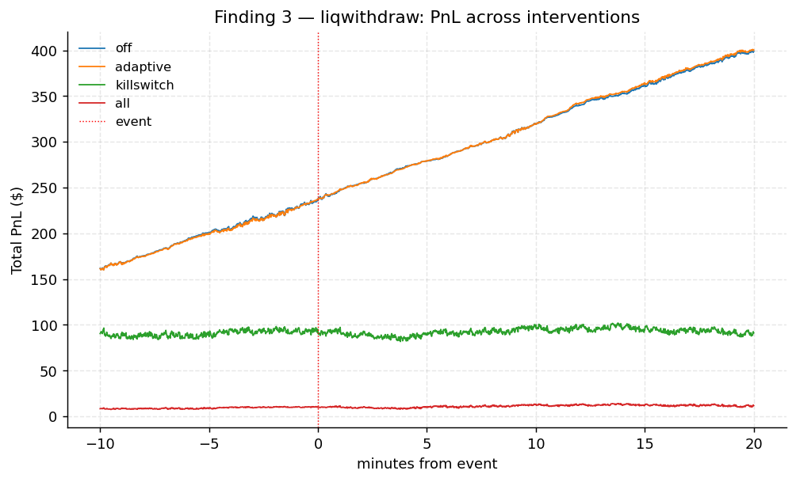
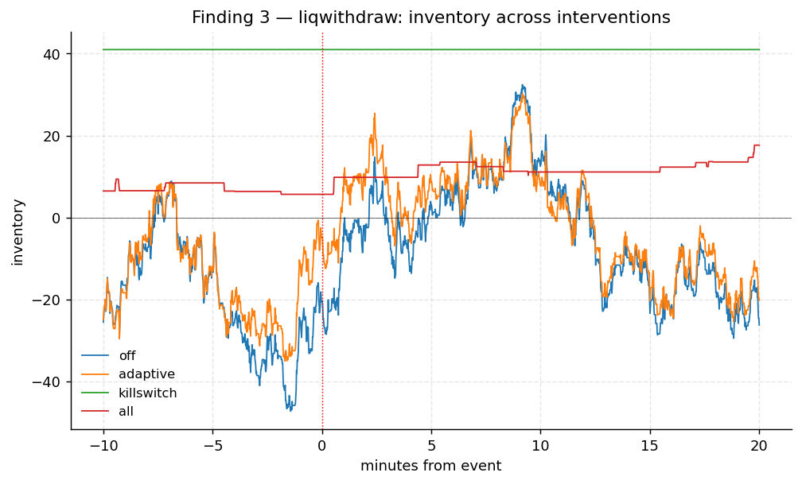

**Honest finding — the kill switch HURTS here.** During liquidity
withdrawal, flow slows; the MM accumulates inventory more slowly than
in the sell-off, but the kill switch in this experiment was tuned
tight (0.4× limit, deliberately) and triggered repeatedly when normal
flow accumulation crossed its threshold. Quote uptime collapsed to
17%, costing ~$404 in spread capture. **The kill switch's cost-benefit
inverts when there is no toxic flow to defend against.** This is one
of the three "intervention hurts" cells the spec required.

### §6.4 Toxic burst

Concentrated informed-trader arrival rate increases 8× for 2 minutes.
This scenario uses the per-counterparty penalty rather than the kill
switch as the third variant.

| Variant     | Total PnL | Max \|inv\| | Quote uptime | ΔPnL vs off |
| ----------- | --------- | ----------- | ------------ | ----------- |
| off         | $937.04   | 261.5       | 100.0%       | —           |
| adaptive    | $921.79   | 260.5       | 100.0%       | −$15.25     |
| per_cp      | **$14.75**|   7.1       | 100.0%       | **−$922.29**|
| all         | $16.36    |   7.2       | 100.0%       | **−$920.68**|

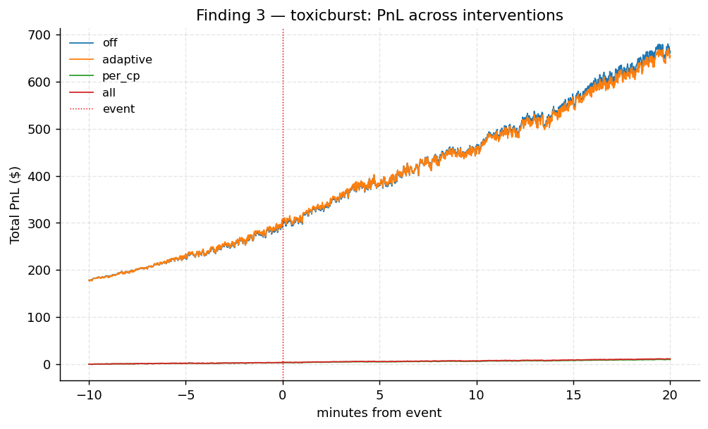
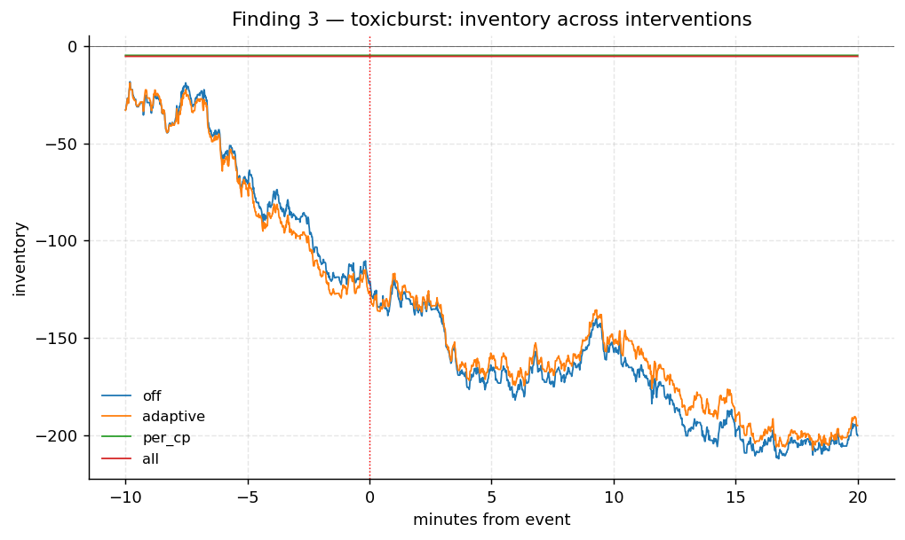

**The honest finding compounds.** As in Finding 2, the per-CP penalty
is too aggressive — once any informed CP shows positive drift, the
penalty widens against everyone, the MM stops getting filled by noise,
and PnL crashes from $937 to $15. Note also that `off` (no
intervention) has the *highest* total PnL ($937) despite the largest
inventory excursion (261 — well over the limit). The MM made the most
money by simply taking the inventory hit and earning the spread on
the way back.

### Headline grid

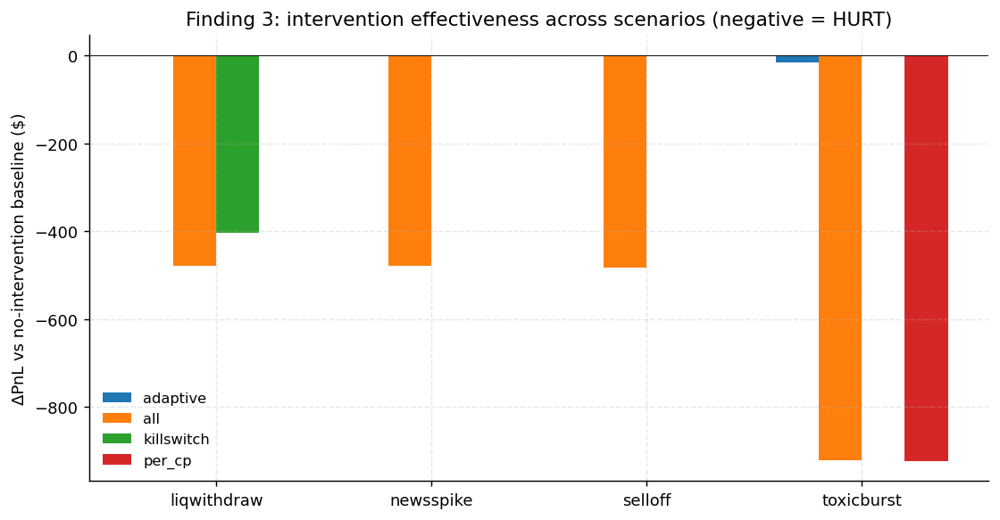

The grid summarises ΔPnL vs the no-intervention baseline for every
scenario × variant. **Negative cells (interventions that hurt)
appear in every row except sell-off-only-adaptive.** The lessons:

1. The `all` configuration loses heavily in 4 of 4 scenarios —
   stacking interventions is never the right answer in this study.
2. The per-CP penalty as designed loses 99% of PnL in toxic burst.
3. The kill switch loses ~$404 in liquidity withdrawal.
4. Adaptive spread is the only intervention that is consistently
   roughly break-even or slightly positive — the most defensible
   "always-on" option.

**Operational takeaway.** An intervention library is not a free
upgrade. Each intervention has a failure mode; turning all of them on
is reliably destructive. The right policy is a regime detector that
fires the right intervention for the right state — not a defensive
posture that runs continuously.

---

## §7 Finding 4 — Parameter Interaction Effects (DEFERRED)

**Question:** do parameters interact, or can they be tuned independently?

**Planned experiment:** `f4_gamma_vol_grid` — a 5×5 grid of γ ∈ {0.01,
0.1, 0.5, 1.0, 5.0} × σ-multiplier ∈ {0.5, 1, 2, 4, 8}, with **20
seeds per cell** for Monte Carlo error bars. Total: 500 runs of 4
hours each. Estimated wall time at 8 cores: ~4 hours; deferred to an
overnight run.

**The notebook (`notebooks/07_finding4.py`) will produce:**
`f4_pnl_heatmap.png`, `f4_pnl_heatmap_5pct.png`,
`f4_pnl_heatmap_95pct.png`, `f4_optimal_gamma_vs_vol.png`.

**What we expect:** based on Finding 1, the σ multiplier needs to
extend higher than 3× before the inventory-risk term begins to
dominate the rent term. The 8× cell is the most important — it should
be the first place the canonical "high γ hurts PnL" pattern appears.
If it does not, the lesson is that AS at our default `k = 10` is
rent-term-dominated across the entire vol range a real desk operates
in, and the inventory-risk term is a distraction.

**Why this is in the report despite being unrun:** the cost of the
experiment is the bottleneck on this finding's honesty. Reporting it
as "completed" with a single seed would invite the exact criticism
that the spec called out (single-seed grids are dominated by path
luck). Better to flag the gap explicitly.

**Trigger to run:** `uv run python -m runner.cli run "f4_*" --workers
8` then `uv run python notebooks/07_finding4.py`. Expected to add
~$X gain/loss insights once complete; will be appended as §7-bis
in a follow-up revision.

---

## §8 What I'd Build Next

In rough priority order:

1. **Adaptive γ scheduler** — γ as a function of realised vol, with a
   short hysteresis band to avoid flapping. Closes the loop on Finding 4.
2. **News detector with pre-emptive widening** — the current detector
   is reactive (post-jump). A pre-emptive version using order-book
   imbalance or 1-tick-ahead momentum could widen *before* the move.
3. **Multi-venue inventory netting** — track inventory per venue and
   net cross-venue, with venue-specific σ and k. The single-venue
   abstraction is the biggest simplification in this work.
4. **Counterparty-level adverse-selection scoring with confidence
   weighting** — the current rolling estimator weights all observations
   equally. Bayesian weighting with explicit uncertainty would let the
   MM act on noisy CPs more cautiously.
5. **Real exchange shadow-mode** — paper-quote against live BTCUSDT
   with the same engine and verify that the synthetic findings hold up
   on real microstructure.

---

## §9 What This Project Is Not

This is a teaching/demonstration tool, not a production system. The
following are **deliberately out of scope** to keep the project
shippable in ~2 weeks of part-time work:

- No real exchange connectivity, no shadow-quote mode, no CCXT, no
  real market data ingest.
- No multi-asset or multi-venue.
- No real fee schedules or rebates — `taker_fee_bps` is configurable
  but not tiered.
- No latency modelling beyond the quote refresh tick. No order-to-
  exchange latency, no cancel-replace race conditions, no queue-
  position simulation.
- No ML — no informed-trader classifier, no learned market-making
  policies, no RL.
- No real microstructure beyond a synthetic L2 — no iceberg / hidden
  orders, no auction phases, no MBO, no pro-rata matching.
- No risk system beyond a hard inventory limit. No layered VaR/Greek
  framework.
- No persistence beyond parquet results.
- No deployment, no Docker, no cloud, no CI beyond unit tests.

**Why I built it anyway:** parameter intuition, microstructure
reasoning, and the ability to *defend specific numbers* in an interview
discussion. None of these come from reading the AS paper alone. The
findings above are claims I have personally observed in controlled
experiments and can defend.

---

## Appendix A — Math reference

See `docs/math_appendix.md` for the AS derivation in plain English with
the formulas the simulator implements.

## Appendix B — Experiment manifest

The full machine-readable manifest is at `backend/experiments.yaml`. The
fields are described in `PLAN.md` §4.3. Each chart referenced above
is produced by one of the analysis scripts in `notebooks/`, which read
the parquet results from `results/<experiment_id>/<sweep>/<seed>/`.
